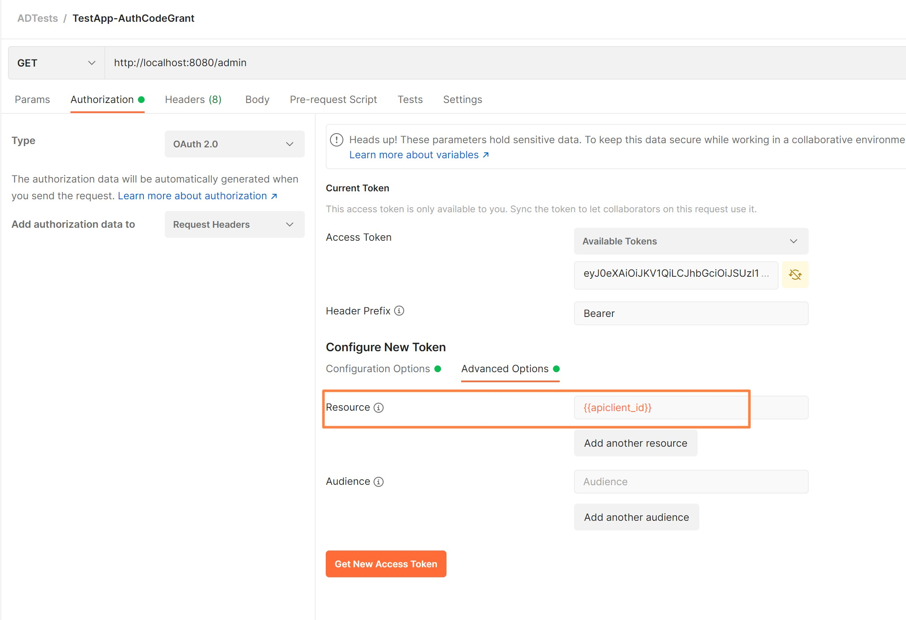

# Securing Spring with Azure AD

This repo contains two examples using Spring Boot REST API secured with Azure AD OAuth2

- [Microsft Azure AD SpringBoot Starter](./ms-aad-restapi)
- [Spring Securoty OAuth 2.0](./spring-security-restapi)

Both examples provide libraries and integration to secure REST API (resource server in OAuth 2.0 jargon) with JWT Tokens.
In both examples we will use same AzureAD app registrations and tests defined in `tests.http" are using client credentials grant to obtain the token and invoke API.

- [Setup Azure API and Client App Registrations](#setup-azure-api-and-client-app-registrations)
- [Microsoft Spring Starter for Azure AD](#microsoft-spring-starter-for-azure-ad)
- [Spring Security with Azure AD](#spring-security-with-azure-ad)
- [Testing with REST Client](#testing-with-rest-client)
- [Testing with Postman](#testing-with-postman)
  - [Authorization Code Grant](#authorization-code-grant)
  - [Client Creds Code Grant](#client-creds-code-grant)
- [Setting Scopes for the API](#setting-scopes-for-the-api)


## Setup Azure API and Client App Registrations

For this example we will simulate two components API Client and API REST Application.

- API REST Application Registration is used by REST API, resource server for the api will validat that JWT tokens have this app registration as `audience`. [Optional setup] This App registration  defines Role exposed by the applications - `Admin` for advanced administrative methods.

- API Client Application is used by REST Client and optionally granted role `Admin` to be able to invoke advanced methods, will get 403 if `/admin` call ig foles not granted.

Follow the docs to 
- [Register the App in AAD](https://docs.microsoft.com/en-us/azure/active-directory/develop/quickstart-register-app)
- [[Optionally] Add Roles to your applications](https://docs.microsoft.com/en-us/azure/active-directory/develop/howto-add-app-roles-in-azure-ad-apps#assign-app-roles-to-applications)

In our example here is the setup:

- Create REST API App Registration `MSAADDemoAPI` and define a role `Admin` exposed by API


- Create Client App Registration `MSAADDemoAPIClient` , create secret and grant it role `Admin`


- [Optionally] Add Role to the user to test Authorization Code Flow. Naviagte to Managed App and add user role


## Microsoft Spring Starter for Azure AD
This example is using Microsoft Azure AD Spring Starter that implements all OIDC flows with AzureAD and hides any AAD setup complexity.
[Microsft Azure AD SpringBoot Starter](./ms-aad-restapi)

## Spring Security with Azure AD
This example provides code that is vendor neutral and is using Apringbott Security Module and configuration pointing to OIDC well known config for AAD.

[Spring Security OAuth 2.0](./spring-security-restapi)

## Testing with REST Client 

In both examples we will use same AzureAD app registrations and tests defined in `tests.http" are using client credentials grant to obtain the token and invoke API. You will need to install  [Rest Client](https://marketplace.visualstudio.com/items?itemName=humao.rest-client) extension in VSCode to run it.

- To obtain Azure AD Token via client_credential flow [Client Credential Flow and default scope](https://docs.microsoft.com/en-us/azure/active-directory/develop/v2-permissions-and-consent#client-credentials-grant-flow-and-default) we will use following HTTP request in `tests.http` (replace valueds for tenant and app registrations to your setup)


``` 
POST https://login.microsoftonline.com/{{tenant}}/oauth2/v2.0/token
Host: login.microsoftonline.com
Content-Type: application/x-www-form-urlencoded

client_id={{appclient_id}}
&client_secret={{appclient_secret}}
&grant_type=client_credentials
&scope={{apiapp_id}}/.default
&request_type=token
```

Scope is always <resource app id>/.default for client_credentials , it will also be used by AAD to set audience in the token


You could verify content of the token at https://jwt.ms, our decoded token - you will see `roles` if granted to client application
```json
{
  "aud": "<apiclient_id>",
  "iss": "https://sts.windows.net/<tenantid>/",
  "iat": 1641967979,
  "nbf": 1641967979,
  "exp": 1641971879,
  "aio": "E2ZgYBCJvVemV+f5aMUG3y6TuQ8YAA==",
  "appid": "<appclient_id>",
  "appidacr": "1",
  "idp": "https://sts.windows.net/<tenantid>/",
  "oid": "xxxx",
  "rh": "0.AVEA-1rmm50Wt0W8wph-dDYql0aDHVId4mBMs_NAAvwUmBdRAAA.",
  "roles": [
    "AdminRole"
  ],
  "sub": "xxxx",
  "tid": "<tenantid>",
  "uti": "vrxcAQO3UUiejUZa1Z6-AQ",
  "ver": "1.0"
}
```
- Run Spring application `mvn spring-boot:run` and test endpoints ( you will receiev 403 in /admin if role not granted )
```
GET http://localhost:8080/echo
Authorization: Bearer {{getToken.response.body.access_token}}

GET http://localhost:8080/admin
Authorization: Bearer {{getToken.response.body.access_token}}
```


## Testing with Postman

Postman app allows for easy setup and tests for [Authorization Code grant](https://docs.microsoft.com/en-us/azure/active-directory/develop/v2-oauth2-auth-code-flow) that issues tokens for users - useful for web applications that have authenticated end users and need to obtain token to call Rest API

- Import Postma collection `ADTests.postman_collection.json` that has two flows AuthZ Code Grant and Client Credentials
- Setup environment that would define your `appclient_id`, `appclient_secret`, `apiclient_id` and `tenantid`

### Authorization Code Grant
- Verify URLS in Authorization and obtain token




where:
```
- Authorization URL: https://login.microsoftonline.com/{{tenantid}}/oauth2/authorize
- Token URL: https://login.microsoftonline.com/{{tenantid}}/oauth2/token
- Grant Type: Authorization Code
- ClientID and Secret are set to values for Application Client App Registration
- [Optionally] Scope (see below the setup):  api://{{apiclient_id}}/Admin
- Important!! Resource: points to REST API App Registration ID as it will be used in audience 
```
Obtain the token  and decode it in `jwt.ms` you would see `User token` for the currently authenticated user. It will ask for consent to grant if used by user first time.

Refer to https://docs.microsoft.com/en-us/azure/active-directory/develop/access-tokens#payload-claims for more details on token fields.
Token will have `aud` set to app registration id for REST API (same as in application.yaml), `roles` with Roles associated with User. And optionally `scp` set to the requested scope (only avilable in user tokens)

```
{
  "aud": "83ef8978-xxxx <apiclient-id used in resource field>",
  "iss": "https://sts.windows.net/<tenantid>/",
  "iat": 1642016283,
  "nbf": 1642016283,
  "exp": 1642020452,
  "acr": "1",
  "aio": "AXQAi/8TAAAAPUBBoB8/e1hNkutJ2eWul5qq2M+f9Lv+Ws/wo4rtW4BodOpDnuQMiKlajg8muugT/b5D2Oduu42Nflpf+0m+Bv+ZL8N+Bd4T9ueOxOgcf8yLYoFx0QGzuJ6YtXnUPm+nmHXNQa0jXqShRqpBdWQ19g==",
  "amr": [
    "pwd",
    "rsa"
  ],
  "appid": "521d8346-xxxx <appclient-id>",
  "appidacr": "1",
  "email": "eneros@microsoft.com",
  "idp": "https://sts.windows.net/tenant/",
  "ipaddr": "76.78.16.222",
  "name": "Elena Neroslavskaya",
  "oid": "fc10c12d-xxxxx",
  "rh": "0.AVEA-1rmm50Wt0W8wph-dDYql0aDHVId4mBMs_NAAvwUmBdRAMc.",
  "roles": [
    "AdminRole"
  ],
  "scp": "Admin",
  "sub": "CSA-sQ-fxr1i7KPrDVzhpZ1FjPwRuIh_iE7HiUsagUk",
  "tid": "tenant",
  "unique_name": "eneros@microsoft.com",
  "uti": "-HQQbKuUcESbh02S3vsSAA",
  "ver": "1.0"
}
```

- verify app endpoints `/echo`, `/admin` and `/adminscope` should work

### Client Creds Code Grant
- Verify settings Authorization and obtain token


where:
```
- Token URL: https://login.microsoftonline.com/{{tenantid}}/oauth2/token
- Grant Type:Client Credentials
- ClientID and Secret are set to values for Application Client App Registration
- [Optionally] Scope (see below the setup):  api://{{apiclient_id}}/.default
- Important!! Resource: points to REST API App Registration ID as it will be used in audience 
```
Obtain the token  and decode it in `jwt.ms` you would see `SP token` for the client application registration. 

```json
{
  "aud": "83ef8978-xxx <apiclient_id>",
  "iss": "https://sts.windows.net/tenant/",
  "iat": 1642015217,
  "nbf": 1642015217,
  "exp": 1642019117,
  "aio": "E2ZgYHjp/+BUtt60hJgPy+7lfPtsBgA=",
  "appid": "521d8346-<appclient_id>",
  "appidacr": "1",
  "idp": "https://sts.windows.net/tenant/",
  "oid": "7369daa6-3797-xxxx",
  "rh": "0.AVEA-1rmm50Wt0W8wph-dDYql0aDHVId4mBMs_NAAvwUmBdRAAA.",
  "roles": [
    "AdminRole"
  ],
  "sub": "7369daa6-xxxx",
  "tid": "tenant",
  "uti": "Y8f51RHiZ0ON5klEqOkJAA",
  "ver": "1.0"
}
```

- verify app endpoints `/echo`, `/admin`  should work (scopes are not available in the client creds tokens)

## Setting Scopes for the API

You could choose to use Scopes vs Roles to do Coarse-Grained Authorization

- Add Scope to REST API App Registration


- Grant Permission to the Scope to Client App Registration


[Aquire Token for AD](https://docs.microsoft.com/en-us/azure/active-directory/develop/scenario-daemon-acquire-token?tabs=dotnet#azure-ad-v10-resources)
[AAD and default scope](https://docs.microsoft.com/en-us/azure/active-directory/develop/v2-permissions-and-consent#the-default-scope)
