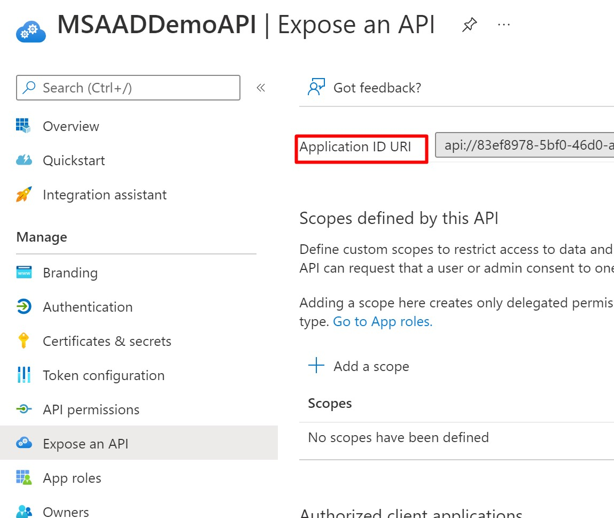

# Microsoft Azure AD SpringBoot Started with REST API

This example is based on the docs [Spring Boot Starter for Azure Active Directory developer's guide](https://docs.microsoft.com/en-us/azure/developer/java/spring-framework/spring-boot-starter-for-azure-active-directory-developer-guide#protect-a-resource-serverapi)

and corresponding GitHub Repo [Azure Samples AAD SpringBoot](https://github.com/Azure-Samples/azure-spring-boot-samples/tree/main/aad/azure-spring-boot-starter-active-directory/aad-resource-server)

## Spring boot Application 

- Create Spring web app with Spring Initializer 
- Add MSFT Starter and OAuth resource server dependencies
```xml
        <dependency>
			<groupId>com.azure.spring</groupId>
			<artifactId>azure-spring-boot-starter-active-directory</artifactId>
			<version>3.10.0</version>
		</dependency>

		<dependency>
			<groupId>org.springframework.boot</groupId>
			<artifactId>spring-boot-starter-oauth2-resource-server</artifactId>
		</dependency>
 ```       

 - Add `client-id`  and `app-id-url` in `application.yml` - copy values from AzureAD->App Registrations-> rest app(<MSAADDemoAPI>) ->Overview 

 

 ```yaml
 azure:
  activedirectory:
    client-id: <api client id>
    app-id-uri: <api://client id> 
 ```

 - Secure the REST API by providing Security config, refer to `AADWebSecurityConfig` class

 - [Optionally] Set required Role on the advances controller methods with Role name prefixed with `APPROLE_`
 
 ```java
    @GetMapping("/admin")
    @ResponseBody
    @PreAuthorize("hasAuthority('APPROLE_AdminRole')")
    public String admin() {
        return "SP has admin success.";
    }

 ```

 - Run the app `mvn spring-boot:run` and test endpoints `/echo` and `/admin`